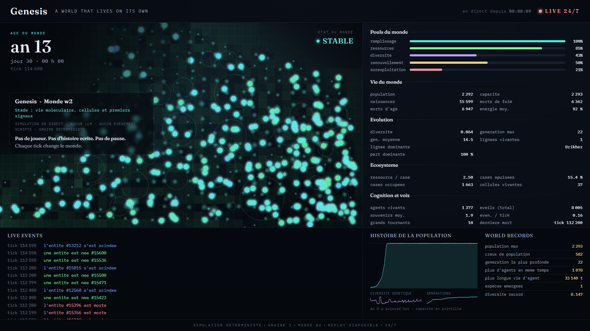
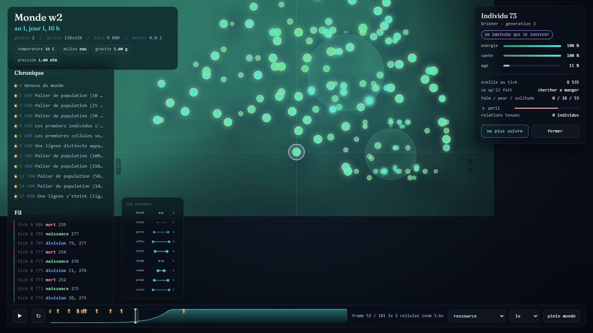
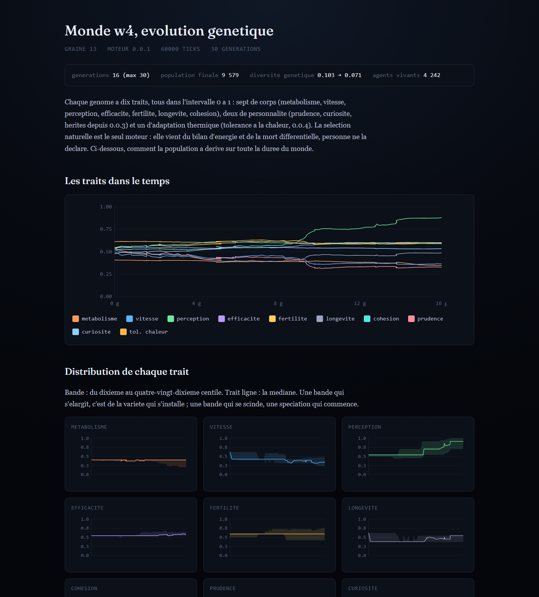
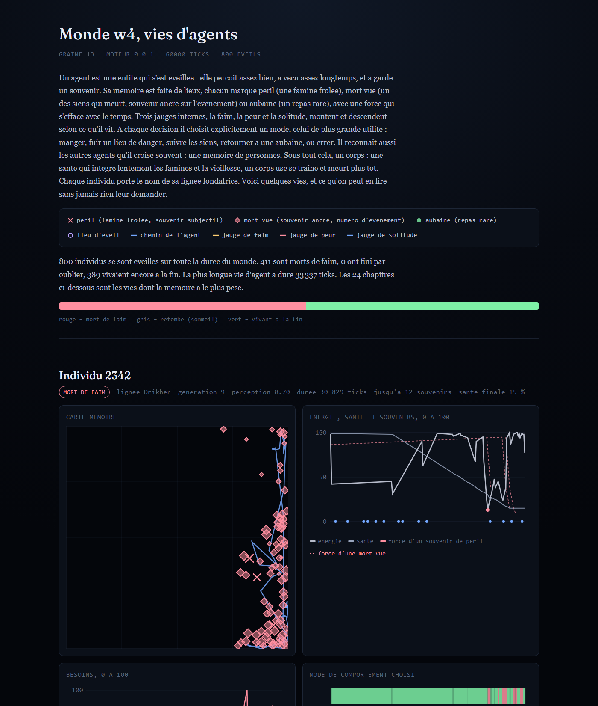
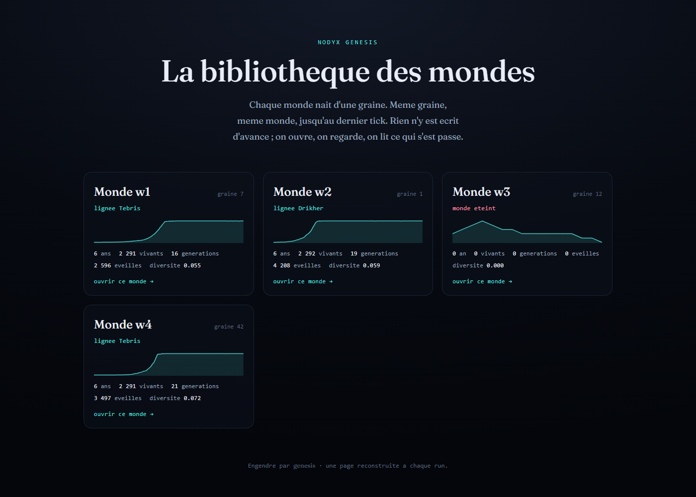

<div align="center">

# Nodyx Genesis

**Un monde vivant qui pousse à partir d'une graine, et que personne ne dirige.**

[](LICENSE)
[](rust-toolchain.toml)
[](#le-pari)
[](#le-pari)



</div>

Genesis pose des règles simples, de la matière, du temps, et regarde ce qui arrive. Des
molécules qui se divisent et mutent. Des amas de parents qui se referment en cellules. Deux
membranes qui n'en font plus qu'une. Des cellules qui adhèrent en tissus, un tissu qui se
contracte comme un muscle, des tissus qui tiennent ensemble en organismes, et un organisme
qui a faim ou qui est repu **en entier**, pas cellule par cellule.

Le monde continue tout seul, sans joueur, sans pause. Aucun modèle de langage n'intervient
dans la simulation. Et surtout :

> **L'histoire n'est jamais écrite.**
> Aucune règle ne nomme un prédateur, un muscle, un organisme. Ce sont des conditions
> d'énergie, de forme, de contact, de durée, que le monde franchit de lui-même. On ne peut pas
> le corriger en douce pour obtenir un monde plus plaisant. C'est ce qui lui laisse la
> possibilité de surprendre ceux qui l'ont fait.

Le projet fait partie de l'écosystème **Nodyx**. Ce qu'il cherche vraiment est dans
[`BIBLE/01_VISION.md`](BIBLE/01_VISION.md). Le registre complet des décisions, avec leur
statut et leur effet mesuré, est dans [`BIBLE/00_INDEX.md`](BIBLE/00_INDEX.md).

---

## Ce qui vit dans le monde

Genesis monte un escalier. À chaque marche, une nouvelle échelle de vie, et rien de nouveau
qui n'ait été franchi par le monde lui-même.

### La matière et le temps

Une grille bornée, une quantité **finie** de matière structurelle, une horloge où un tick
vaut une heure-monde. Deux entités fondatrices. Rien d'autre au départ.

### Les entités

Elles se déplacent par chimiotaxie vers la nourriture, brûlent de l'énergie, se divisent
avec mutation, vieillissent, meurent de faim ou d'âge. La **sélection naturelle** est le
seul tri, personne ne la déclare. Le génome compte dix traits, dont la tolérance à la
chaleur qui laisse la population s'adapter au climat de sa planète.

### Le climat et les saisons

La température moyenne, la gravité, la pression sont fixées à la création. Un monde loin de
son optimum thermique est plus dur à habiter. À graine égale, une planète nettement plus
froide porte deux fois moins de monde.

La capacité nourricière du sol **oscille** au fil de l'année-monde. Saison grasse, la
population déborde. Saison maigre, une famine synchrone la rabote de moitié, et chaque goulot
de disette rebrasse le centre génétique de la population. Le monde de référence n'est plus une
ligne plate collée à son plafond, il respire.

### Les agents qui se souviennent

Une entité qui perçoit assez bien et a vécu assez longtemps **s'éveille** en agent. Elle
gagne une mémoire faite de lieux, chacun marqué par un péril, une aubaine, ou la mort d'un
proche vue de ses yeux, avec une force qui s'efface avec le temps. Trois jauges internes, la
faim, la peur, la solitude, pèsent sur ses choix. À chaque décision elle retient un mode :
chercher à manger, fuir un danger, suivre les siens, revenir à une aubaine, ou errer. Elle
reconnaît les autres agents qu'elle croise souvent.

Chaque agent a une **biographie**, engendrée à partir des données sans aucun modèle de
langage : naissance, souvenirs tracés jusqu'à leur fait d'origine, tempérament, relations,
mort.

### La Voix

Un agent qui frôle la mort par famine émet une **alarme** à sa position. Les agents proches
l'entendent et ont un sursaut de peur. Un agent qui mange bien sur une case franchement riche
lance à l'inverse un **appel**, et les agents proches infléchissent leur trajectoire vers
lui. Deux genres de signal, fixes, aucun lexique codé. La panique disperse, l'appel rassemble.

### Les cellules

Un groupe d'entités proches, génétiquement parentes, cohésives et persistant devient une
**cellule** : une membrane qui partage l'énergie et protège la reproduction de ses membres.
Deux cellules stables aux membranes chevauchantes et aux génomes proches **fusionnent**. Une
cellule grande, mûre et assez étirée se **pince en deux**. La cellule devient une unité qui
se reproduit, et la sélection agit désormais à son niveau.

### Les tissus

Des cellules de génome proche dont les membranes se touchent **adhèrent**. Une traction douce
les rapproche jusqu'au contact, et le tissu prend la forme d'un pavage. Un paramètre d'ordre,
l'ordre orientationnel à six plis, mesure à quel point ce pavage tend vers l'hexagone : c'est
le signal de la phase hexatique, la fusion 2D, le même que celui mesuré sur de vraies
monocouches de cellules.

Chaque tissu reçoit un **type**, jamais décrété, lu de sa forme et de sa composition comme on
quantifie un génome en clé d'espèce : épithélium (une nappe ordonnée), conjonctif (une trame
lâche), muscle (des cellules étirées), adipeux (des cellules gorgées d'énergie), squelettique
(vieux et ordonné), nerveux (peuplé d'agents). Et des types qui **comptent**, pas seulement
nommés : une cellule assez fusiforme exerce une force axiale oscillante, déphasée par une onde
qui traverse le tissu — le muscle se contracte, et peut suivre le gradient de nourriture au
lieu de battre sur place. Une nappe assez ordonnée fait **rempart** : rien ne l'atteint plus,
pas même son bord. Un tissu assez peuplé d'agents **relaie** leurs alarmes et leurs appels bien
au-delà de la portée d'un individu seul, comme un influx qui se propage.

### Les organismes

Une composante connexe de cellules qui se touchent, **sans exiger qu'elles soient parentes**,
ce qui laisse plusieurs types de tissus tenir dans une même unité. Reconnue après quelques
contrôles tenus, elle reçoit une identité stable et un **nom**, qu'elle garde même quand sa
composition change. Elle naît, elle peut fusionner avec une autre, elle se défait. Et son
énergie est **mise en commun** : l'organisme a faim ou est repu en entier. C'est ce qui le
fait individu et plus colonie.

Un organisme assez grand finit par se **scinder** en deux : ses cellules se répartissent selon
l'axe où il s'étire le plus, une moitié garde le nom, l'autre en reçoit un neuf. Une identité
qui persistait devient une identité qui se **multiplie** — la condition pour qu'un jour un
trait propre à l'organisme, pas seulement à ses cellules, se sélectionne sur la durée.

### La prédation

Une entité qui a faim et qui a à portée une entité nettement plus faible la mange. Aucune
règle ne nomme un prédateur, c'est une condition d'énergie et de distance. La prédation
diversifie le génome, à l'inverse de la fusion, et pousse les traits dans le sens de
l'explosion cambrienne : prudence, fécondité, perception.

---

## Le direct

Un monde n'a pas besoin de s'arrêter.

```
genesis serve worlds/w2 --port 8080 --rate 45
```

`genesis serve` reprend un monde depuis son dernier instantané et le fait avancer sans fin,
par petits pas pacés. Avec `--port`, il sert le monde en HTTP, et `stream.html`, un tableau
de bord de direct pensé pour OBS, devient accessible dans un navigateur.

C'est une **vue publique des données que Genesis produit déjà**, rien n'est inventé : l'âge du
monde, le pouls du monde en cinq jauges, le génome dominant en double hélice avec la dérive de
chaque trait depuis la genèse, le fil des événements, la courbe de population de toute la vie
du monde avec ses grands tournants, les records, et la scène où les cellules glissent d'un
tick à l'autre au lieu de sauter, où les tissus se pavent, où les organismes portent leur nom.

Un monde qui tourne des mois finit par manquer de mémoire. Les biographies terminées sont
oubliées au fil de l'eau, la série temporelle est plafonnée, le journal roule en pyramide.
Avec `--restart`, quand le monde meurt, une nouvelle graine repart au même endroit et les
records se transmettent.

---

## Regarder un monde

Chaque monde généré s'ouvre par sa page de garde, `index.html`, avec un chapeau écrit à
partir de ses chiffres, sans modèle de langage. Trois portes en partent.

| | |
|---|---|
|  | **La scène** (`view.html`) montre le monde en mouvement, image par image. On peut lire, rejouer, changer la vitesse. Un clic sur un point ouvre la carte de l'individu : sa lignée, son âge, sa santé, et s'il se souvient, ses jauges, ses souvenirs les plus forts, ses relations. Le bouton suivre garde la caméra sur lui pendant qu'il vit. |
|  | **L'évolution** (`series.html`) trace la dérive des dix traits du génome sur toute la durée du monde. Pas seulement la moyenne : la distribution complète, du dixième au quatre-vingt-dixième centile, parce qu'une bande qui se scinde signale une spéciation. |
|  | **Les vies** (`lives.html`) sont des biographies engendrées à partir des données, sans aucun modèle de langage. Naissance, souvenirs tracés jusqu'à leur fait d'origine, tempérament, mode de décision, relations, mort. C'est là qu'on lit, individu par individu, si le comportement dépend vraiment du souvenir. |



`genesis gallery` reconstruit `worlds/index.html`, la grille qui rassemble tous les mondes
générés.

---

## Le pari

Même graine, même configuration, même version du moteur : le monde est identique **à l'octet
près**, tick après tick. C'est ce qui rend les expériences reproductibles, et c'est aussi ce
qui empêche de tricher.

```
genesis replay worlds/w2
```

La commande rejoue le monde depuis sa graine et affiche `deterministe : OK`, ou `DIFF` avec la
position exacte de la divergence. Le déterminisme est vérifié à un thread et à huit threads,
journaux et instantanés byte-identiques.

Tout changement de règle passe par une **comparaison à graine égale**, avec son effet
documenté (population, diversité génétique, dérive des traits, causes de mort). On ne règle
jamais une règle parce qu'elle a produit un monde plus agréable à regarder.

---

## Démarrer

Le moteur est écrit en Rust. Le fichier `rust-toolchain.toml` fixe la chaîne, `rustup` la
récupère.

```
curl --proto '=https' --tlsv1.2 -sSf https://sh.rustup.rs | sh   # Windows : https://rustup.rs
cargo install --path crates/genesis-cli
genesis run --seed 1 --ticks 60000 --out worlds/w2
```

Sans installation : `cargo run --release -p genesis-cli -- run --seed 1 --ticks 60000 --out
worlds/w2`. Soixante mille ticks font environ sept années-monde et une trentaine de
générations. Les options utiles : `--config` pour pointer une configuration `.toml` (par
défaut, les chiffres de `BIBLE/genesis.starter.toml`), `--frame-every` pour l'intervalle
entre deux images.

Le dossier de sortie contient la configuration utilisée, les métadonnées du monde, les
instantanés du World State, le journal des événements et sa chronique, les frames du
ViewState, la série temporelle, les pages HTML, et le petit état vivant relu par l'overlay.

```
cargo test
```

Les tests d'invariants sont dans `crates/genesis-core/tests/invariants.rs` : même graine même
monde à la frame près, instantané plus rejeu égal état vivant, ordre des événements, mémoire
et besoins bornés, alarmes et appels bornés, cellules cohérentes y compris aux ticks de
fusion, tissus qui se forment et se classent, organismes dont l'identité ne clignote pas,
prédation qui conserve le compte des morts, climat et saisons qui façonnent le monde sans le
casser.

---

## Les mondes de démonstration

Le dépôt définit ses mondes de référence par leur **graine**. Ils ne sont pas versionnés
(trop gros), mais toujours régénérables à l'identique.

**w2**, graine 1, est le monde de référence et celui tenu en direct. Grille 240 sur 240,
plafond de population vers quinze mille, une population qui respire entre six mille et
quatorze mille au fil de l'année. Prédation, tissus, abri du tissu et organismes tous
allumés : une centaine de cellules vivantes, des tissus qui se forment, des organismes qui
naissent et se nomment. Il dérive, c'est voulu.

**w5**, graine 24, est le banc d'essai de l'adhésion persistante (`tissue_bond`) et du
rempart épithélial (`epithelium_shield`), allumés dès la genèse (le génome co-évolue avec
eux, contrairement à un allumage en cours de vie qui casse la lignée pluricellulaire, voir
`BIBLE/experiments/013`). Même grille, mêmes leviers que w2, plus ces deux-là. Tenu en
direct à part, sur `--port 8081`, pour ne jamais toucher à w2.

**w6**, graine 26, va plus loin : toute la pile (adhésion, rempart, muscle, et la
locomotion dirigée, `muscle_seek_food`) allumée dès la genèse. Un tissu contractile y suit
le gradient de nourriture au lieu de battre sur place (`BIBLE/experiments/015`). Huit types
de tissus vus en même temps sur ses premières années, dont adipeux et conjonctif, des
organismes nommés qui persistent. Tenu en direct sur `--port 8082`.

**w7**, graine 40, ajoute le relais nerveux (`nerve_relay`) à toute la pile de w6, dès la
genèse : un tissu qui compte assez de membres agents relaie leurs alarmes et leurs appels
bien au-delà de la portée d'un individu seul (`BIBLE/experiments/017`). Fondation plus
laborieuse que d'habitude (six graines éteintes avant que la 40 tienne), mais une fois
établi, un monde qui respire fort : quatre mille à quinze mille d'une saison à l'autre, une
douzaine de types de tissus vus en pointe. Tenu en direct sur `--port 8083`.

**w1** (graine 8) a les disettes les plus violentes et la plus haute diversité génétique.
**w4** (graine 13) est le plus foisonnant, une douzaine d'émergences d'espèce. **w3**
(graine 4) ne prend pas : les deux lignées fondatrices s'éteignent avant la première
année-monde. Toutes les graines ne donnent pas un monde viable, et sa page de garde le dit
sans détour.

---

## Le corpus

[`BIBLE/`](BIBLE/) rassemble la référence du projet. Point d'entrée :
[`00_INDEX.md`](BIBLE/00_INDEX.md), toutes les décisions avec leur statut et leur effet
mesuré. [`01_VISION.md`](BIBLE/01_VISION.md) dit ce que le projet cherche.
[`02_ARCHITECTURE.md`](BIBLE/02_ARCHITECTURE.md) pose les dix invariants et le contrat du
ViewState. [`03_DATA_MODEL.md`](BIBLE/03_DATA_MODEL.md) décrit le modèle de données.
[`10_ROADMAP.md`](BIBLE/10_ROADMAP.md) tient les jalons. `experiments/` garde les prototypes
et leurs A/B, notamment [`009_organism.md`](BIBLE/experiments/009_organism.md), le chemin
cellule vers tissu vers organe, et sa suite `018` à `022`, le génome structurel : ce qui a
marché, ce qui a coûté cher, ce qui reste ouvert, chaque fois avec les chiffres.

---

## Structure du dépôt

```
crates/
  genesis-core/     World State, tick, evenements, cognition, cellules, tissus, organismes, climat ; ne connait aucun rendu
  genesis-view/     le contrat ViewState : projection pure du monde en flux observable
  genesis-cli/      le binaire genesis : run, replay, continue, serve, gallery ; pages HTML et overlay
BIBLE/              le corpus de reference
experiments/        les prototypes numeriques et leurs A/B
worlds/             les mondes generes, regenerables par leur graine
docs/               les captures de cette page
```

La frontière est verrouillée : `genesis-core` ne connaît pas le rendu, `genesis-view` dépend
de `genesis-core` et jamais l'inverse.

---

## Où va le projet

Sept jalons, de la molécule au monde qui parle. La cible probante minimale, un individu qui
se souvient et dont on peut lire la biographie, est **atteinte**. Le travail actuel creuse le
passage de la cellule à l'organe.

| Jalon | Ce que ça ajoute | État |
|---|---|---|
| 0.0.1 Deux | énergie, mouvement, reproduction, mutation, mort, graine, ViewState, rejeu déterministe | fait |
| 0.0.2 Vie | génome complet, sélection naturelle, cellules, fusion, division, tissus, types de tissus qui comptent, organismes qui se reproduisent, prédation, muscle | en cours, profond |
| 0.0.3 Individus | mémoire, personnalité, besoins, relations, biographie, sans LLM | **cible probante atteinte** |
| 0.0.4 Voix | signaux, saisons, tolérance à la chaleur, langage émergent | démarré |
| 0.0.5 Société | culture, mémoire collective, premier LLM en cloud | à venir |
| 0.0.6 Civilisation | villages, économie, institutions, toutes émergentes | à venir |
| 0.1.0 Le monde qui parle | couche numérique Nodyx : wiki, forum, émissaire ; la bibliothèque de mondes devient publique | à venir |

Le chemin de l'organe a avancé : l'épithélium fait barrière, le nerveux relaie les signaux —
seul l'adipeux qui tamponne reste à trouver (le premier essai, une réserve qui ne se vide que
dans le besoin, s'est révélé sans prise sur un monde déjà lissé par ailleurs). Et l'organisme
sait désormais se scinder en deux : une identité qui persistait devient une identité qui se
multiplie, la condition nécessaire à une sélection qui lui soit propre. Un premier gène hérité à
cette échelle existe déjà, à la façon des créatures de Karl Sims, mais sa dérive sous sélection
reste à prouver : les organismes sont encore trop rares, sur les durées testées, pour un signal
net. Plusieurs essais de gènes individuels portés par une cellule (l'adhésion, le rôle) ont
buté sur le même mur — dilués par un contexte collectif qui n'a rien à voir avec le gène, ou
coûteux à la population — une leçon consignée dans `BIBLE/experiments/018` à `022` : la
sélection veut porter le gène directement par l'unité qui se reproduit, pas par un intermédiaire
dilué.

---

## Licence

MIT. Voir [`LICENSE`](LICENSE).
