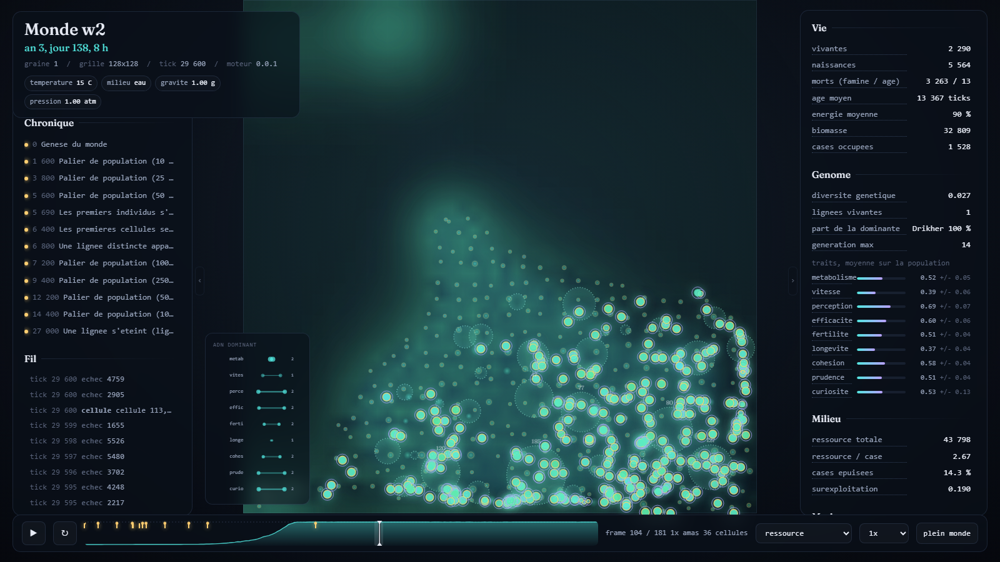
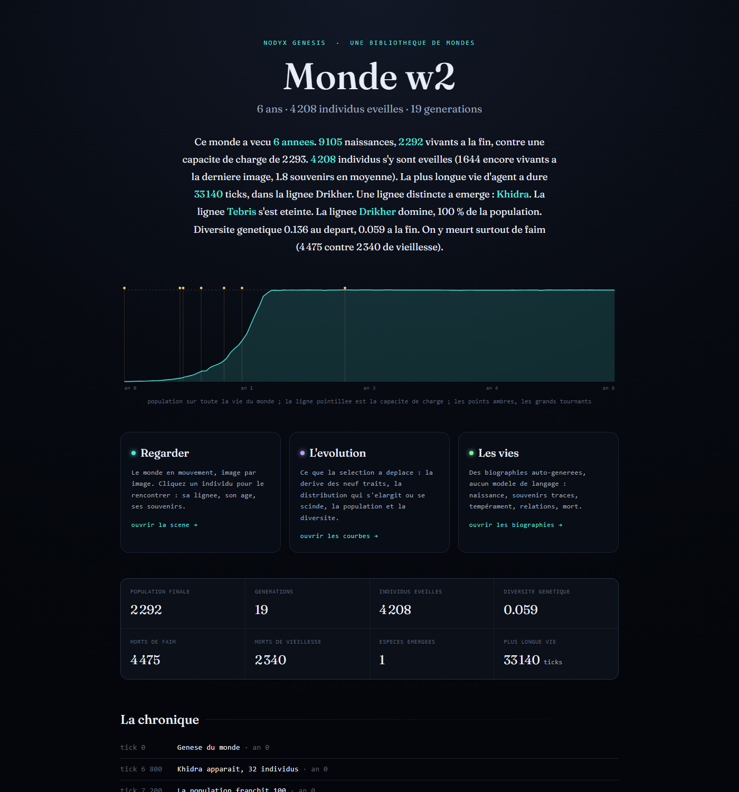

# Nodyx Genesis

Nodyx Genesis est un moteur de simulation qui fait pousser un monde vivant a partir d'une
graine. On pose des regles simples, de la matiere, du temps, et on regarde ce qui arrive :
des molecules qui se divisent, des cellules qui se forment, des individus qui gardent des
souvenirs et changent de comportement selon ce qu'ils ont vecu. Le monde continue tout seul,
sans joueur, et rien de ce qui s'y passe n'est ecrit d'avance. Aucun modele de langage
n'intervient dans la simulation.

Le projet fait partie de l'ecosysteme Nodyx. Ce qu'il cherche vraiment, et pourquoi, est
decrit dans `BIBLE/01_VISION.md`. Le registre complet des decisions, avec leur statut, est
dans `BIBLE/00_INDEX.md`.



## Ce que fait le moteur aujourd'hui

Le jalon 0.0.3, "Individus", est atteint. Sa cible etait modeste et verifiable : un individu
qui se souvient, dont on peut lire la biographie. Une entite s'eveille en agent quand elle
percoit assez bien et a vecu assez longtemps ; elle gagne alors une memoire faite de lieux,
chacun marque par un peril, une aubaine ou la mort d'un proche, avec une force qui s'efface
avec le temps. Trois jauges internes, la faim, la peur et la solitude, pesent sur ses choix.
A chaque decision elle retient explicitement un mode : chercher a manger, fuir un lieu de
danger, suivre les siens, retourner a une aubaine, ou errer. Elle reconnait les autres
agents qu'elle croise souvent. Sous tout cela, un corps, avec une sante qui integre lentement
les famines repetees et la vieillesse.

Le jalon suivant, 0.0.4, "Voix", vient de commencer. Un agent qui frole la mort par famine
emet une alarme a sa position. Les agents proches l'entendent et ont un sursaut de peur, sans
qu'aucun souvenir ne se forme. Aucun lexique n'est code. A graine egale, cette seule regle
divise les morts par famine d'environ un dixieme et augmente nettement la diversite genetique :
un cri, et les voisins quittent une zone qui tue.

Tout changement de regle passe par une comparaison a graine egale, avec son effet documente.
On ne regle jamais une regle parce qu'elle a produit un monde plus plaisant.

## Le pari du determinisme

Meme graine, meme configuration, meme version du moteur : le monde est identique a l'octet
pres, tick apres tick. C'est ce qui rend les experiences reproductibles, et c'est aussi ce
qui permet au monde de surprendre ses createurs, puisqu'on ne peut pas le corriger en douce.

```
cargo run --release -p genesis-cli -- replay worlds/w2
```

La commande rejoue le monde depuis sa graine et affiche `deterministe : OK`, ou `DIFF` avec
la position exacte de la divergence. Le determinisme est verifie a un thread et a huit
threads, journaux et instantanes byte-identiques.

## Regarder un monde

Chaque monde genere s'ouvre par sa page de garde, `index.html`. Un chapeau ecrit a partir de
ses chiffres, sans modele de langage, raconte l'essentiel : les annees vecues, les
naissances, la plus longue vie d'agent et sa lignee, les especes qui ont emerge, les lignees
qui se sont eteintes, de quoi on y meurt. Une courbe montre la population sur toute la vie du
monde. Trois portes menent aux trois lecteurs.



**La scene**, `view.html`, montre le monde en mouvement, image par image. On peut lire,
rejouer, changer la vitesse, se mettre en plein cadre. Un clic sur un point ouvre la carte de
l'individu : sa lignee, son age, sa sante, et s'il se souvient, son eveil, ce qu'il fait, ses
jauges, ses souvenirs les plus forts, ses relations. Le bouton suivre cadre la camera sur lui
et le garde au centre pendant qu'il vit ; la molette zoome ou l'on veut.


**L'evolution**, `series.html`, trace la derive des neuf traits du genome sur toute la duree
du monde. Pas seulement la moyenne : la distribution complete, du dixieme au quatre-vingt-
dixieme centile, parce que c'est une bande qui se scinde qui signale une speciation. La
selection naturelle est le seul moteur ici, personne ne la declare.


**Les vies**, `lives.html`, sont des biographies engendrees a partir des donnees, sans aucun
modele de langage. Naissance, souvenirs traces jusqu'a leur fait d'origine, temperament,
mode de decision, relations, mort. C'est la qu'on lit, individu par individu, si le
comportement depend vraiment du souvenir.


## Les mondes de demonstration

Le depot est livre avec quatre mondes de reference, dans `worlds/`. Chacun nait d'une graine
differente et raconte une histoire differente. La commande `genesis gallery` reconstruit
`worlds/index.html`, une grille qui les rassemble ; elle est aussi refaite a la fin de chaque
run.


Le monde **w2**, graine 1, est le monde de reference du projet. Il vit six annees, atteint
dix-neuf generations, voit s'eveiller plus de quatre mille individus. Une espece, Khidra,
emerge tot. La lignee Tebris s'eteint vers la troisieme annee, et Drikher reste seule a la
fin. La plus longue vie d'agent y dure trente-trois mille ticks. C'est le monde ou la
cognition fait le plus nettement basculer la population : on y meurt moins de faim et plus de
vieillesse qu'avant elle.

Le monde **w1**, graine 7, atteint une population comparable mais garde ses deux lignees
fondatrices jusqu'au bout. La survie y reste rude : la plupart des individus meurent encore
de faim. Un monde stable, mais dur.

Le monde **w4**, graine 42, est le plus profond et le plus varie des quatre : vingt et une
generations, la diversite genetique la plus haute. C'est la lignee Drikher qui s'y eteint,
l'inverse de w2, a partir de la meme regle et sans que rien ne le decide.

Le monde **w3**, graine 12, meurt jeune : la population monte, culmine, puis s'effondre, et
le monde s'eteint avant sa premiere annee. Toutes les graines ne donnent pas un monde
viable, et c'est voulu. Sa page de garde le dit sans detour.

## Installer et lancer

Le moteur est ecrit en Rust. Le fichier `rust-toolchain.toml` fixe la chaine a stable, et
`rustup` la recupere automatiquement.

```
curl --proto '=https' --tlsv1.2 -sSf https://sh.rustup.rs | sh
```

Sous Windows, l'installeur est sur `https://rustup.rs`.

Pour faire naitre un monde :

```
cargo run --release -p genesis-cli -- run --seed 1 --ticks 60000 --out worlds/w2
```

Les options utiles sont `--out` pour le dossier de sortie, `--config` pour pointer une
configuration `.toml` (par defaut, les chiffres de `BIBLE/genesis.starter.toml`), et
`--frame-every` pour l'intervalle entre deux images visuelles. Une longueur de run de
soixante mille ticks correspond a environ six annees-monde et une vingtaine de generations.

Le dossier de sortie contient la configuration utilisee, les metadonnees du monde, les
instantanes du World State, le journal complet des evenements et sa version reduite aux
evenements saillants, les frames du ViewState, la serie temporelle des statistiques, et les
cinq pages HTML : `index.html`, `view.html`, `series.html`, `lives.html`, plus la
bibliotheque `worlds/index.html` un cran au-dessus.

## Tester

```
cargo test
```

Les tests d'invariants sont dans `crates/genesis-core/tests/invariants.rs` : meme graine
meme monde a la frame pres, instantane plus rejeu egal etat vivant, ordre des evenements,
memoire et besoins bornes sur quarante mille ticks, les alarmes emises et bornees, les
cellules coherentes, la personnalite et la sante dans leurs limites.

## Le corpus

`BIBLE/` rassemble la reference du projet. Le point d'entree est `00_INDEX.md`, qui liste
toutes les decisions avec leur statut. `01_VISION.md` dit ce que le projet cherche.
`02_ARCHITECTURE.md` pose les dix invariants et le contrat du ViewState. `03_DATA_MODEL.md`
decrit le modele de donnees. `04_SIMULATION.md` traite du temps. `05_COGNITION.md` suit le
pont de l'entite vers l'agent, tranche par tranche. `10_ROADMAP.md` tient les sept jalons.
`GENESIS_FIDELITY.md` verifie l'ecart entre le projet voulu et le projet decide.

## Structure du depot

```
Cargo.toml               le workspace
rust-toolchain.toml
crates/
  genesis-core/          World State, tick, evenements, cognition, persistance ; ne connait aucun rendu
  genesis-view/          le contrat ViewState : projection pure du monde en flux observable
  genesis-cli/           le binaire genesis : run, replay, gallery, generation des pages
BIBLE/                   le corpus de reference
experiments/             les prototypes numeriques
worlds/                  les mondes generes, regenerables par leur graine
docs/                    les captures de cette page
```

La frontiere est verrouillee : `genesis-core` ne connait pas le rendu, `genesis-view` depend
de `genesis-core` et jamais l'inverse.

## Licence

MIT. Voir `LICENSE`.
